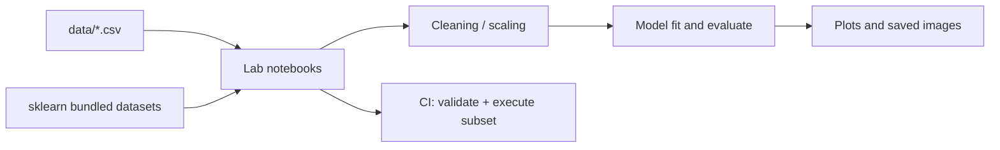

# 23CSE301 — Machine Learning Labs

> Jupyter notebooks for the 23CSE301 Machine Learning course: 22 labs covering supervised and unsupervised learning with scikit-learn.

[](https://github.com/AkashNaickar/23CSE301/actions/workflows/ci.yml)
[](LICENSE)

Coursework for Machine Learning (III Year V Sem, AY 2026-27). Each lab has a
worked implementation notebook plus exercises. Everything runs locally against
the committed CSVs and the datasets bundled with scikit-learn.

## Labs

| Lab | Notebook | Topic | Data |
|-----|----------|-------|------|
| 5 | [Linear Regression 01](Linear%20Regression/23cse301-linearregression-01.ipynb) | Simple linear regression | `data/Salary_Data.csv` |
| 5 | [Linear Regression 02](Linear%20Regression/23cse301-linearregression-02.ipynb) | Predict taxi fare from trip miles | `data/chicago_taxi_trips.csv` |
| 5 | [Linear Regression 03](Linear%20Regression/23cse301-linearregression-03.ipynb) | Predict body weight from height and age | `data/linregrp3_dataset.csv` |
| 6 | [Logistic Regression 01](Logistic%20Regression/23cse301-logisticregression-01.ipynb) | Binary classification | `data/diabets.csv` |
| 6 | [Logistic Regression 02](Logistic%20Regression/23cse301-logisticregression-02.ipynb) | Graduate admission prediction | `data/Admission_Predict.csv` |
| 7 | [Decision Tree 01](Decison%20Tree%20Classifier/23cse301-decisiontree-01.ipynb) | Entropy-based decision tree | `data/diabets.csv` |
| 7 | [Decision Tree 02](Decison%20Tree%20Classifier/23cse301-decisiontree-02.ipynb) | Age/income house purchase | inline data |
| 7 | [Decision Tree 03](Decison%20Tree%20Classifier/23cse301-decisiontree-03.ipynb) | Weather: go out / stay in | inline data |
| 8 | [SVM 01](Support%20Vector%20Machine/23cse301-svm-01.ipynb) | Linear and RBF kernels | `data/diabets.csv` |
| 8 | [SVM 02](Support%20Vector%20Machine/23cse301-svm-02.ipynb) | RBF kernel on quadratic data | generated (seeded) |
| 8 | [SVM 03](Support%20Vector%20Machine/23cse301-svm-03.ipynb) | Spam classification | `data/spambase.data` |
| 9 | [KNN 01](K%20Nearest%20Neighbors/23cse301-knn-01.ipynb) | Breast cancer detection | `data/breast_cancer_master.csv` |
| 9 | [KNN 02](K%20Nearest%20Neighbors/23cse301-knn-02.ipynb) | Handwritten digit recognition | `sklearn.datasets.load_digits` |
| 9 | [KNN 03](K%20Nearest%20Neighbors/23cse301-knn-03.ipynb) | Euclidean distance calculation | inline data |
| 10 | [K-Means 01](K%20Means%20Clustering/23cse301-kmeans-01.ipynb) | Elbow method / cluster selection | generated (seeded) |
| 10 | [K-Means 02](K%20Means%20Clustering/23cse301-kmeans-02.ipynb) | Old Faithful geyser clustering | `data/geyser.csv` |
| 10 | [K-Means 03](K%20Means%20Clustering/23cse301-kmeans-03.ipynb) | Image compression (k=16) | generated gradient image |
| 11 | [PCA 01](Principal%20Component%20Analysis/23cse301-pca-01.ipynb) | PCA dimensionality reduction | `sklearn.datasets.load_breast_cancer` |
| 11 | [PCA 02](Principal%20Component%20Analysis/23cse301-pca-02.ipynb) | Real-estate analysis | `sklearn.datasets.fetch_california_housing`* |
| 11 | [PCA 03](Principal%20Component%20Analysis/23cse301-pca-03.ipynb) | Identify principal components from loadings | inline data |
| 12 | [Random Forest 01](Random%20Forests/23cse301-randomforest-01.ipynb) | Ensemble classification | `data/breast_cancer_master.csv` |
| 12 | [Random Forest 02](Random%20Forests/23cse301-randomforest-02.ipynb) | Random forest ensemble concept | `data/breast_cancer_master.csv` |

\* `fetch_california_housing` downloads the dataset on first run, so this
notebook needs network access. It is validated statically but excluded from the
offline execution subset in CI.

### Example output

The K-Means image-compression lab writes a compressed image with
`plt.imsave(...)`; the committed result of that run is shown below.


## Dataset files

All CSVs the labs load are committed under `data/`:

| File | Used by |
|------|---------|
| `Admission_Predict.csv` | Logistic Regression 02 |
| `Salary_Data.csv` | Linear Regression 01 |
| `chicago_taxi_trips.csv` | Linear Regression 02 |
| `linregrp3_dataset.csv` | Linear Regression 03 |
| `diabets.csv` | Logistic Regression 01, Decision Tree 01, SVM 01 |
| `breast_cancer_master.csv` | KNN 01, Random Forest 01/02 |
| `geyser.csv` | K-Means 02 |
| `spambase.data` | SVM 03 |
| `diabetes_data.csv`, `heart_failure_clinical_records_dataset.csv`, `wdbc.data` | reference datasets in `data/` |

## Setup

Tested with Python 3.12 from a clean checkout:

```bash
git clone https://github.com/AkashNaickar/23CSE301.git
cd 23CSE301
python -m venv .venv
# Windows: .venv\Scripts\activate
source .venv/bin/activate
pip install -r requirements.txt
jupyter lab
```

`requirements.txt` pins the exact versions that CI installs. No environment
variables or configuration files are required.

## Testing

Notebooks are validated and executed headlessly. Both commands run in CI, and
were run locally against the pinned dependencies before opening the PR.

```bash
# Static checks: nbformat validity, all code cells compile, imports resolve,
# and every referenced dataset exists.
python scripts/validate_notebooks.py

# Execute a subset of notebooks end to end, offline.
python scripts/run_notebooks.py
```

`validate_notebooks.py` covers all 22 notebooks. `run_notebooks.py` executes 13
notebooks that only use local or bundled data (the network-backed PCA 02
notebook is validated statically only).

## Viewing the notebooks

There is no hosted deployment for this repository — notebooks are not a web
app. To read them rendered without installing anything, open a notebook path
through [nbviewer](https://nbviewer.org/github/AkashNaickar/23CSE301/tree/main/),
or use GitHub's built-in notebook preview.

## Tech stack

| Layer | Tech |
|-------|------|
| Language | Python 3.12 |
| Data | pandas, numpy |
| ML | scikit-learn |
| Plots | matplotlib, seaborn |
| Notebooks | Jupyter, nbformat, nbclient, nbconvert |
| CI | GitHub Actions |

## How it fits together



## Roadmap

- [ ] Add a short conclusion cell to each exercise notebook.
- [ ] Extend the executed subset in CI as notebooks become fully offline.
- [ ] Convert notebooks to a reproducible script format with `jupytext`.

## Contributing

Issues and PRs are welcome. See [CONTRIBUTING.md](CONTRIBUTING.md) for the
branch naming, notebook conventions, and test commands. In short: keep notebooks
runnable from a clean checkout and make sure both
`python scripts/validate_notebooks.py` and `python scripts/run_notebooks.py`
pass before opening a PR.

Participation is covered by the [Code of Conduct](CODE_OF_CONDUCT.md). Report
security issues privately as described in [SECURITY.md](SECURITY.md).

## License

MIT — see [LICENSE](LICENSE).
